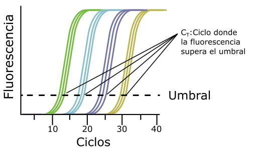

# Guia para el análisis de qPCR - Cuantificación relativa

## Fundamentos

### Técnica

La cuantificación relativa que se hace a través de una qPCR depende de la medida de fluorescencia en tiempo real durante la amplificación, y el parámetro que permite hacer la cuantificación es Ct. 

*Umbral y Ct*

Ct es el ciclo en el que la fluorescencia de la muestra supera el umbral. Este umbral es puesto por el investigador. Una guía para colocar el umbral es la fluorescencia de los controles negativos y los blancos. El nivel de fluorescencia de estos controles debe estar siempre por debajo del umbral que se establezca. Al finalizar la qPCR, se obtienen los valores de Ct para cada una de las muestras.

### Cuantificación

Para la cuantificación el umbral establecido va a funcionar entonces como una “meta” que indica una cantidad igual de productos de PCR detectados por su fluorescencia. El parámetro que se mide entonces es el tiempo (en ciclos) que se demora una muestra en llegar a ese umbral (Ct). Entre mayor sea Ct **menor** será la cantidad de cADN inicial para el gen amplificado. De manera contraria, entre menor sea el Ct, **mayor** será la cantidad inicial del gen amplificado.

Dependiendo del Ct se puede cuantificar relativamente la cantidad del gen de interés en una muestra comparado con una muestra control. Dicho en términos de estudios de expresión génica, cuanto más se expresa un gen en una muestra o condición comparado con una muestra control. 

La cuantificación precisa se hace teniendo en cuenta que cada ciclo se duplica la cantidad de amplicones en una muestra. Esto es importante porque si una muestra A se demora un ciclo más en llegar al umbral que una muestra B, quiere decir que la muestra B tiene el doble de cantidad del gen de interés que la muestra A (o de otra manera, que la muestra A tiene la mitad de cantidad del gen de interés que la muestra B). De esta manera usando la diferencia entre los Ct de las muestras de interés se puede calcular la cantidad de ARNm del gen de interés en la condición experimental en términos de "veces" la cantidad del mismo gen en la condición control (*fold-change*) [^1].

Finalmente, lo último para tener en cuenta es que estos valores tienen que normalizarse. Esto se hace con respecto a un gen cuya expresión no cambia en diferentes condiciones (gen *housekeeping*) usando el Ct de la siguiente manera [^1]: 

1. Se calcula la diferencia de Ct del gen de interés entre la condición control y la condición de interés &Delta;Ct gen.
  - &Delta;Ct gen = Ct gen (cond control) - Ct gen (cond interés)
2. Se calcula la diferencia de Ct del gen *housekeeping* entre la condición control y la condición de interés &Delta;Ct hk.
  - &Delta;Ct hk = Ct hk (cond control) - Ct hk (cond interés) 
3. Se calcula el &Delta;&Delta;Ct.
  - &Delta;&Delta;Ct = &Delta;Ct gen - &Delta;Ct hk
4. Finalmente se calcula la diferencia de expresión (*fold-change*) del gen de interés.
  - *fold-change* = 2^-(&Delta;&Delta;Ct).

  > Esto es asumiendo que la eficiencia de la reacción es del 100%. Es decir que cada ciclo la cantidad de producto de PCR es **exactamente** el doble que en el ciclo anterior. Esto es lo esperado para amplicones de alrededor de 150pb [^1]. Sin embargo, la formula propuesta por Livak y Schmittgen incluye el valor de la eficiencia y se puede reemplazar cuando este valor es diferente al 100% de la siguiente manera:
  
  > Diferencia de expresión = (1+Eficiencia)^-(&Delta;&Delta;Ct).

## Calculos

Guía para calcular expresión diferencial de un gen usando el paquete de R `pcr` [^2].

### Preparación

Antes de hacer los cálculos de eficiencia de la reacción y de expresión diferencial es necesario organizar los datos en un formato compatible con el paquete `pcr`. Primero se promedian los valores de Ct de las replicas técnicas para cada una de las replicas biológicas. Luego los valores de Ct se organizan en filas y los genes en columnas de la siguiente manera:

|b-tubulina|Fenol-Monooxigenasa|
|-----------|-------------|
|30.72|23.70|
|30.34|23.56|
|30.58|23.47|
|30.34|23.65|
|30.50|23.69|
|30.43|23.68|
|27.06|22.76|
|27.03|22.61|
|27.03|22.62|
|27.10|22.60|
|26.99|22.61|
|26.94|22.76|

A pesar de que las muestras deben estar organizadas por tratamiento (en este caso las 6 primeras pertenecen a la condición control “Glucosa” y las 6 siguientes a la condición experimental “Fenol”), los tratamientos no se colocan en la tabla. Para esto se crea un vector con los nombres de los tratamientos:

`tratamientos <- rep(c(“Glucosa”,”Fenol”), each=6)`

Los datos correspondientes a la curva se organizan de la misma manera en una tabla que contiene los valores de Ct por separado (sin promediar) para las diferentes diluciones: 

|b-tubulina|Fenol-Monooxigenasa|
|-----------|-------------|
|25.57823| 22.60794|
|25.53636| 22.68348|
|25.50280|22.62602|
|26.70615| 23.67162|
|26.72720| 23.64855|
|26.86921|23.70494|
|28.16874| 25.11064|
|28.06759| 25.11985|
|28.10531| 25.10976|
|29.19743| 26.16919|
|29.49406| 26.15119|
|29.07117 |26.15019|
|30.16878 |27.11533|
|30.14193 |27.13934|
|30.11671 |27.16338|

Y luego se crea un vector con los valores relativos de las diluciones seriadas de la siguiente manera:

`#Para una curva de 5 puntos de diluciones seriadas 1:10

diluciones <- rep(c(1,0.1,0.01,0.001,0.0001), each= 3)`

### Cálculo de la eficiencia de reacción

### Cálculo de expresión diferencial

[^1]: Livak KJ, Schmittgen TD. Analysis of relative gene expression data using real-time quantitative PCR and the 2(-Delta Delta C(T)) Method. Methods. 2001 Dec;25(4):402-8. https://doi.org/10.1006/meth.2001.1262. PMID: 11846609.

[^2]: Ahmed M, Kim DR. pcr: an R package for quality assessment, analysis and testing of qPCR data. PeerJ. 2018 Mar 16;6:e4473. https://doi.org/10.7717/peerj.4473. PMID: 29576953; PMCID: PMC5858653.

[^3]: Obermeyer S, Stöckl R, Schnekenburger T, Moehle C, Schwartz U, Grasser KD. Distinct role of subunits of the Arabidopsis RNA polymerase II elongation factor PAF1C in transcriptional reprogramming. Front Plant Sci. 2022 Sep 29;13:974625. doi: 10.3389/fpls.2022.974625. PMID: 36247629; PMCID: PMC9558118.

[^4]: Yuan, J.S., Reed, A., Chen, F. et al. Statistical analysis of real-time PCR data. BMC Bioinformatics 7, 85 (2006). https://doi.org/10.1186/1471-2105-7-85
